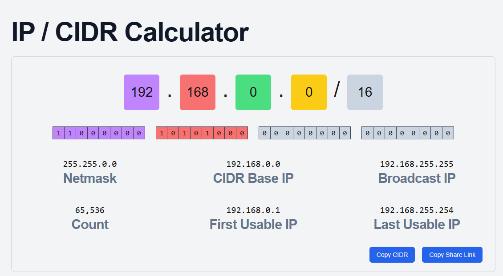

# Part 1: OSI Model Layers Explained with a Smart Home Example

**I use a smart home thermostat communicating with a cloud server to adjust room temperature. This example illustrates how the OSI model enables seamless IoT (Internet of Things) operations**

### 1. Application Layer (Layer 7)
The interface for end-user applications to access network services.

Example:
The thermostat’s application sends a temperature adjustment request to the cloud server using HTTP/HTTPS.

### 2. Presentation Layer (Layer 6)
This encrypts, compresses, or translates data for compatibility.

Example:
The temperature data is encrypted (using TLS) to protect user privacy and formatted into JSON/XML for the server to understand.

### 3. Session Layer (Layer 5)
This manages and maintains active connections between devices.

Example:
A persistent session is established between the thermostat and the cloud server to allow continuous communication (e.g., hourly temperature updates).

### 4. Transport Layer (Layer 4)
This ensures reliable or fast data delivery.

Example:
TCP is used to guarantee the temperature command reaches the server. If the thermostat streams live sensor data, UDP might prioritize speed over reliability.

### 5. Network Layer (Layer 3)
This routes data across networks using IP addresses.

Example:
The thermostat’s IP address (e.g., 192.168.1.10) and the cloud server’s IP address (e.g., 104.18.22.34) let routers guide data through the internet.

### 6. Data Link Layer (Layer 2)
This transfers data between devices on the same local network.

Example:
The thermostat connects to a Wi-Fi router. The router uses the thermostat’s MAC address (e.g., AA:BB:CC:DD:EE:FF) to ensure data reaches the correct device.

### 7. Physical Layer (Layer 1)
This transmits raw electrical, radio, or optical signals.

Example:
The thermostat’s Wi-Fi chip converts data into radio waves transmitted to the router. Alternatively, a wired thermostat might use Ethernet cables.

## In summary (i.e End-to-End Communication Flow)

### 1. Sending Data:

- The user sets a temperature via the app (Layer 7).

- Data is encrypted (Layer 6) and a session is maintained (Layer 5).

- TCP splits the command into packets (Layer 4).

- Routers use IP addresses to guide packets (Layer 3).

- The local Wi-Fi network uses MAC addresses (Layer 2).

- Radio waves carry the signal to the router (Layer 1).

### 2. Receiving Data:

- The cloud server decrypts the data (Layer 6) and confirms the session (Layer 5).

- TCP reassembles packets (Layer 4) and sends an acknowledgment.

- The thermostat’s Wi-Fi chip receives radio signals (Layer 1), validates the MAC address (Layer 2), and adjusts the temperature.

# Part 3: Using a subnetting calculator to calculate subnets for a given IP range and document the results.

### Using **192.168.0.0/16** cidr IP range on https://cidr.xyz/, below is the results

- IP Address: 192.168.0.0
- Network Address: 192.168.0.0
- Subnet Mask: 255.255.0.0
- First Host: 192.168.0.1
- Last Host: 192.168.255.254
- Broadcast Address: 192.168.255.255
- CIDR Notation: 192.168.0.0/16
- Usable Host Count: 65534

# Part 2: A short analysis of how the TCP/IP protocol suite operates across layers in a real-world scenario

### The TCP/IP protocol suite, operates across 4 layers—Application, Transport, Internet, and Network Access which enable seamless data exchange.

**1. Application Layer**

This layer interfaces with user applications and high-level protocols (e.g., HTTP, DNS, TLS).

*Scenario:*
The browser initiates a request for https://www.fajmayor.com.

- *DNS Query:* The Application Layer uses DNS to resolve www.fajmayor.com to an IP address (e.g., 93.184.216.34).

- *HTTPS Request:* The browser formats the request using HTTP and encrypts it via TLS/SSL for security.

**2. Transport Layer**
This layer ensures end-to-end communication with reliability (TCP) or speed (UDP).

*Scenario:*
- TCP Connection: A three-way handshake (SYN, SYN-ACK, ACK) establishes a connection between the client and server.

- Segmentation: The HTTP request is split into manageable TCP segments, with source/destination port numbers (e.g., port 443 for HTTPS).

- Reliability: TCP ensures all segments arrive intact, retransmitting lost packets and reordering them if needed.

**3. Internet Layer**
This layer routes data across networks using IP addresses.

*Scenario:*
- IP Packets: TCP segments are wrapped into IP packets with source (client’s IP) and destination (server’s IP) addresses.

- Routing: Routers examine the destination IP to guide packets through the internet, hopping between networks until they reach the server.

- Fragmentation: If packets exceed a network’s MTU (Maximum Transmission Unit), they are fragmented and reassembled at the destination.

**4. Network Access Layer**
This layer manages physical transmission over hardware (e.g., Ethernet, Wi-Fi).

*Scenario:*
- Framing: IP packets are encapsulated into Ethernet frames (or Wi-Fi frames) with MAC addresses for local network devices (e.g., router’s MAC).

- Physical Transmission: Frames are converted into electrical signals (wired) or radio waves (wireless) and transmitted to the next hop (e.g., home router).